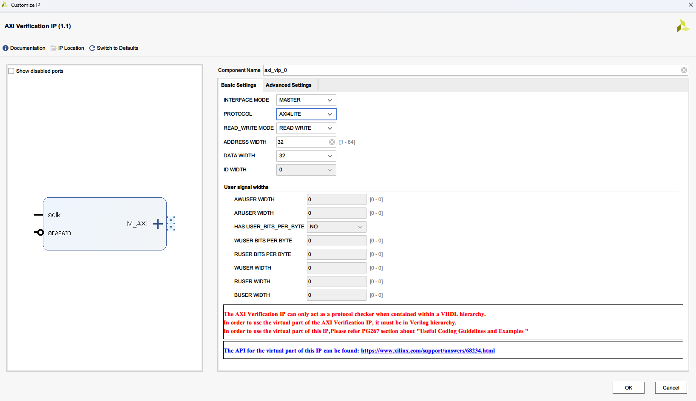

# 体验Xlinx官方提供的AXI VIP核

## AXI VIP作为AXI Lite主机
### 例化AXI VIP核
打开IP Catalog，输入AXI VIP，选择AXI VIP核：

选择接口类型、协议类型、数据宽度等参数，然后点击Finish，完成IP核的例化。

### 将AXI VIP核连接到设计
只需要将AXI VIP的AXI接口和设计中的AXI接口相连，其它非AXI信号则在端口声明。

### 仿真
1. 导入相关包：
``` Systemverilog
import axi_vip_pkg::*;          // AXI VIP核的包
import axi_vip_0_pkg::*;        // axi_vip_0与例化名称一致
```

2. 创建的AXI VIP主设备代理实例：
``` Systemverilog
axi_vip_0_mst_t       mst_agent;
```

3. 初始化并启动AXI VIP主设备代理：
``` Systemverilog
mst_agent = new("master vip agent",u_axi_vip_axi_lite_ram.u_axi_vip_0.inst.IF);
mst_agent.start_master();
```

4. 读写的AXI VIP函数：
``` Systemverilog
mst_agent.AXI4LITE_WRITE_BURST(addr,port,data,resp);
mst_agent.AXI4LITE_READ_BURST(addr,port,data,resp);
```
